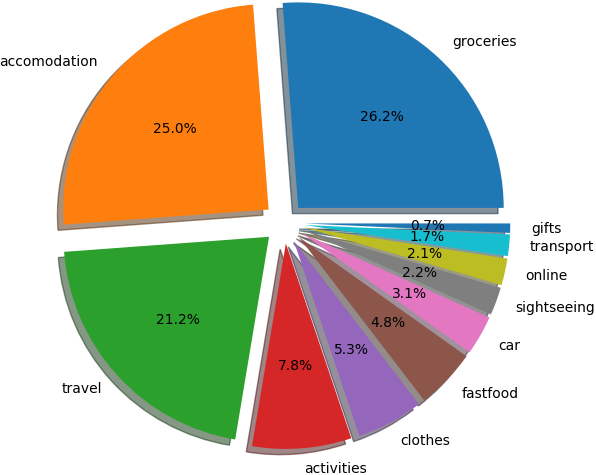
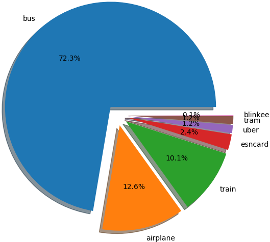
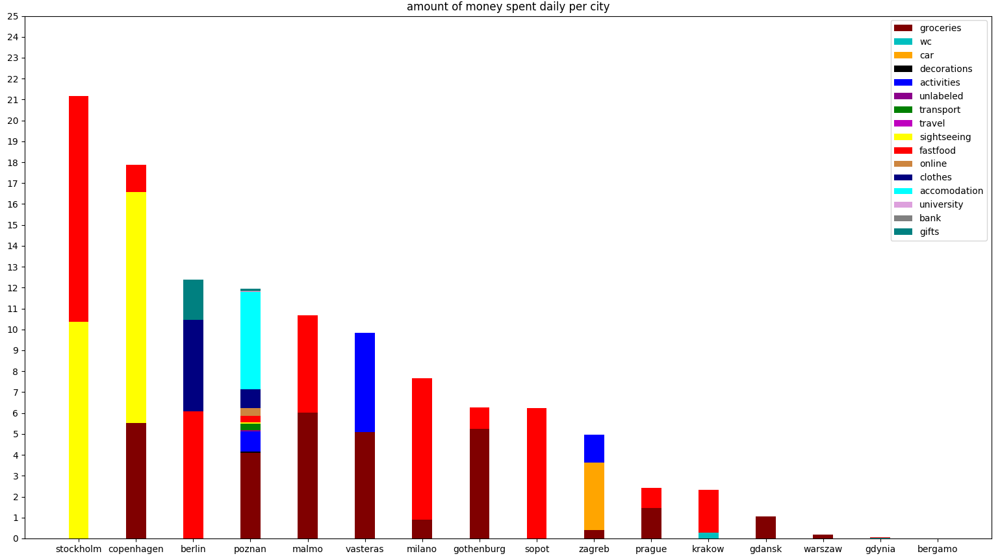
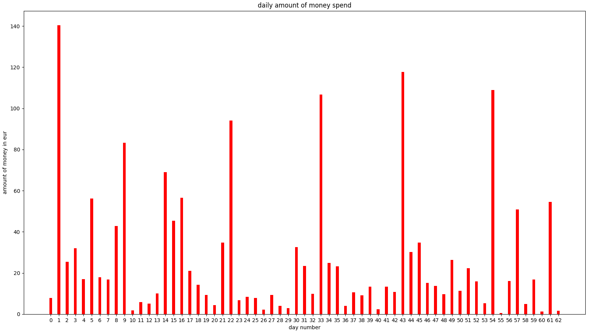

# analyzing daily expenses, real use-case

> I don't see the benefit of this being a gist, let alone a jupyter notebook, if
one is so eager to run the code themselves I provided one with minor changes
due to the original code using api keys I'm not willing to share.

each day people spend money on various things.
each transaction holds a bunch of meta information.
instead of going to waste that information can be used to learn about one's tendencies.
what percentage of money is spent on food? on transport? traveling?
how expensive are the cities that were visited?
how much money is spent daily? weekly? monthly?
can we use the data to predict our future expenses based on our location?

the data set I keep consists of the following columns:
```
1   hrk - croatian kuna, amount of money spent in the currency of Croatia,
2   vendor - company that I bought an item/service from,
3   date - DD.MM.YYYY or DD.MM.,
4   description - specifically what I spent money on (ice-skating, food, bus, alcohol...),
5   meansofpayment - cash/credit-card/paypal,
6   city - lowercase name of the city,
7   category - more general than description e.g. (bus, train, tram) -> transport,
8   currency - three letter code of the currency e.g. HRK, EUR, PLN...,
9   country - lowercase name of the country (shortened name if possible e.g. czechia),
10  lcy - local currency, amount of money spent in the local currency of current transaction,
11  eur - euro, amount of money spent in euros,
12  tags - something that will remind me of the record,
13  recurrence - is the expense likely to be repeated (yes/no)
```

## questions to be answered:

1. what percentage of money is spent on groceries, activities, traveling...?
2. what is the preferred public transport?
3. how expensive is each city daily?
4. how much money is spent daily?
5. how much money will be spent in the upcoming days?

### questions 1-4 pseudocode

1. preprocess
	1. read data
	2. fill empty data
		1. date = add year where needed
		2. country = get_country_from_city
		3. currency = get_currency_from_country
		4. currencies
			1. if hrk not set: hrk = lcy * get_rate(currency, 'HRK' date)
			2. if eur not set: eur = hrk * get_rate('HRK', 'EUR', date)
2. plot graphs
	1. category - money pie chart
	2. public transport pie chart
  3. daily city expenses stacked bar chart
  4. daily expense bar chart

importing libraries

```python
import pandas as pd                   # reading csv files and dataframes
import numpy as np                    # matrix manipulation
from datetime import date, timedelta  # date manipulation
from geopy import geocoders           # getting country names from city names
import requests                       # getting exchange rates for currencies
import matplotlib.pyplot as plt       # plotting processed data
```

reading data from a .csv file
```python
df = pd.read_csv('./expenses.csv')
print(df.iloc[90:130, :11])
```


upon quick inspection one can denote the marginal scarcity of data.
whats more, in the last couple of columns the dates aren't even fully completed.
throwing a glance at the pseudocode provided above one can fleetly conclude
that is not a problem.
all the missing data can be filled from what we already have.

1. date = add year where needed
2. country = get_country_from_city
3. currency = get_currency_from_country
4. if hrk not set: hrk = lcy * get_exchange_rate(currency, 'HRK', date)
5. if eur not set: eur = hrk * get_exchange_rate('HRK', 'EUR', date)

fortunately non of the relevant information is missing (cost) for any of the
entries, but if there were such entries the mean of the column would replace
the empty record.

the data will be processed in one swoop, the goal is to iterate over the set
only once.

```python
def city_to_country(city):
    gn = geocoders.GeoNames("", "<---myUsername--->")
    return gn.geocode(city)[0].split(", ")[2].lower())

def get_exchange_rate(base_currency, target_currency, date):
    if base_currency == target_currency:
        return 1
    date_formatted = "-".join(date[:-1].split('.')[::-1])
    api_uri = "https://free.currencyconverterapi.com/api/v6/convert?q={}&compact=ultra&date={}"\
        .format(base_currency + "_" + target_currency, date_formatted)
    api_response = requests.get(api_uri)
    if api_response.status_code == 200:
        return float(api_response.json()[base_currency+"_"+target_currency][date_formatted])

country_to_currency = {
        'croatia': 'HRK',
        'poland': 'PLN',
        'italy': 'EUR',
        'germany': 'EUR',
        'sweden': 'SEK',
        'denmark': 'DKK',
        'czechia': 'CZK',
        }

def transform_row(r):
    if len(r.date) == 6:
        r.date += '2018.'
    d = r.date[:-1].split('.')
    r.date = date(*map(int, d[::-1]))
    r.country = city_to_country(r.city)
    r.currency = country_to_currency[r.country]
    if np.isnan(r.hrk):
        r.hrk = r.lcy * get_exchange_rate(r.currency, 'HRK', r.date)
    r.eur = r.hrk * get_exchange_rate('HRK', 'EUR', r.date)
    return r

df = df.apply(transform_row, axis=1) # applying the function to each row
print(df.iloc[90:130, :11])
```


most of the data is filled, the data that isn't won't be used in
plotting our graphs anyway so there is no need to fill out the rest.
now it's time to start answering questions!

### what percentage of money is spent on groceries, activities, traveling...?

grouping the entries by category and assigning the sum of money spent to each
of them is the way to go. this can be best presented with a pie chart.

```python
category_sum = []
for category, rows in df.groupby(['category'])['eur']:
    category_sum.append((sum(rows.values), category))
sums, labels = zip(*sorted(category_sum, reverse=True)[:11])
explode = [0.1]*len(sums)

fig1, ax1 = plt.subplots()
ax1.pie(sums, explode=explode, labels=labels, autopct='%1.1f%%',
        shadow=True, startangle=0)
ax1.axis('equal')
plt.title('percentage of money spend on each category')
plt.show()
```



the chart isn't all that surprising.
what maybe catches one's eye is the transport cost which seems unbelievably low.
that is merely due to my habit of mostly walking.
even more so when everything is close in Poznan.

### what is the preferred public transport (including traveling)?

this is a very similar problem to the one above.
entries are to be grouped by description where the category value is 'transport' or 'travel'.
an important note is that personal transportation (car/motorbike) is excluded.

```python
preferred_transport = []
for desc, rows in df.groupby(['description']):
    if all(i in ['travel', 'transport'] for i in rows['category']):
        preferred_transport.append((sum(rows['eur'].values), desc))

sums, labels = zip(*sorted(preferred_transport, reverse=True))
explode = [0.1]*len(sums)

fig1, ax1 = plt.subplots()
ax1.pie(sums, explode=explode, labels=labels, autopct='%1.1f%%',
        shadow=True, startangle=0)
ax1.axis('equal')
plt.title('preferred public transport')
plt.show()
```



this chart poses more questions than it answers.
but...
since this should be somewhat of a short read it will be benificial not to
delve into the depths here because more interesting things are on the radar.

### how expensive is each city daily?

what could be done is, rinsing and repeating, pie chart spewing.
but!
this question can be answered in a flashier manner.
namely, since the data contains what was the money spent on during each day,
that information can be plotted on the graph as well.
all the travel information must be excluded!

```python
all_categories = tuple(set(df['category']) - set('travel'))
cities_daily = []
for city, rows in df.groupby(['city']):
    days = set(rows['date'].values)
    days = (max(days) - min(days)).days + 1
    descs = {desc: sum(rs['eur'].values)/days for desc, rs in rows[rows['category'] != 'travel'].groupby(['category'])}
    cities_daily.append((city, tuple(descs[i] if i in descs else 0 for i in all_categories)))

cities, sums = zip(*sorted(cities_daily, reverse=True, key=lambda t: sum(t[1])))
sums = list(zip(*sums))

ind = np.arange(len(cities))
width = 0.35
colors = ['maroon','c','orange','k','b','darkmagenta','g','m','yellow','r','peru','navy','cyan','plum','grey','teal','lime']
bars = [plt.bar(ind, sums[0], width, color=colors[0])]
for i in range(1, len(all_categories)):
    bars.append(plt.bar(ind, sums[i], width, bottom=list(map(sum, zip(*sums[:i]))), color=colors[i]))

plt.title('amount of money spent daily per city')
plt.xticks(ind, cities)
plt.yticks(np.arange(0, 26, 1))
plt.legend(list(zip(*bars))[0], all_categories)
plt.show()
```



what does this chart tell us?
firstly, pizza hut's 'Big cheesy B' is not worth 20 euros
(the stockholm fastfood expense) even if you split the bill with your significant
other.
secondly, a banana in sweden is more expensive than lunch in poland...
jokes aside, one can notice that even when accomodation is free,
traveling is really expensive when you don't have a kitchen.

> free accomodation was made possible by sleeping by friends, in buses/trains,
couch surfing, etc.

on a further note, instead of just getting rid of the 'travel' category, it would be
beneficial to drop categories such as 'clothes', 'gifts' and other
minorities although it's not much of a difference.

### how much money is spent daily?

instead of just summing the amount of money for each day,
it is benificial if we extract the information which city belongs to which day.
doing things this way will already have the data prepared for
doing a little bit of computer science predicting the future expenses later on.

```python
daily_expenses = []
cities = []
all_dates = list(pd.date_range(min(df['date']), max(df['date']), freq='D'))
for d in list(all_dates):
    value = sum(df[df['date'] == d.date()]['eur'])
    if value:
        cities.append(df[df['date'] == d.date()]['city'].values[-1])
        daily_expenses.append((d.date(), value))
    else:
        all_dates.remove(d)
dates, sums = zip(*daily_expenses)

ind = np.arange(len(all_dates))
plt.bar(ind, sums, color='red', width=0.35)
plt.xticks(ind, list(range(len(all_dates))))
plt.title('daily amount of money spend')
plt.xlabel('day number')
plt.ylabel('amount of money in eur')
plt.show()
```



this looks like it's going to need some clipping.
but let's not be pessimistic just yet.
we'll revisit this if it amounts to a problem.

## what about question 5?

> how much money will be spent in the upcoming days?

usually, this would be approached differently;
one would try to evalue which machine learning method would be best
suitable for adapting to the plotted function.
but in this case, we'll pretend to be british empirists, turn a blind eye and
just do regression.

### linear regression pseudocode

1. preprocess
	1. convert data into a daily table, with dates and city information
	2. encode categorical data
	3. avoid the dummy variable trap
	4. split data into test and train sets
	5. feature scale
2. building our regression model
	1. fit the regressor to our train set
	2. remove columns that are not beneficial
		1. backward elimination
	3. predict values
3. plot results

### multiple linear regression

the city column has to be encoded into <n> columns each representing one city.

```python
x = np.array([*zip(range(len(dates)), cities)])
y = sums
from sklearn.preprocessing import OneHotEncoder
from sklearn.compose import ColumnTransformer, make_column_transformer
preprocess = make_column_transformer((OneHotEncoder(), [-1])).fit_transform(x)
x = np.array([*zip(preprocess, x[:, 0])])
```

now we have to avoid the
[dummy variable](https://en.wikipedia.org/wiki/Dummy_variable_(statistics)) trap.

```python
x = x[:, 1:]
```

next up is to split the data into a test and train sets.
80% of the data will be used to train the model, and the rest used for the test set.
`ytest` is the test data we'll compare the regression results to.

```python
from sklearn.model_selection import train_test_split as tts
xtrain, xtest, ytrain, ytest = tts(x, y, test_size = 0.2)
```

following the pseudocode the regressor should be created and fit to the train set.

```python
from sklearn.linear_model import LinearRegression
regressor = LinearRegression()
regressor.fit(xtrain, ytrain)
```

`ypred` is the list of predicted values using multiple linear regression with
all the data available (dates, cities).

```python
ypred = regressor.predict(xtest)
```

what we could do now is compare the results to the `ytest` and call it a day.
but we're not gonna stop there, let's ask ourselves a question.
how beneficial is the abundace of information we're feeding to the regressor?
let's build a quick
[backward elimination](https://en.wikipedia.org/wiki/Stepwise_regression#Main_approaches)
algorithm and let it choose the columns it wants to leave inside.
we'll set the [p-value](https://en.wikipedia.org/wiki/P-value)
to the standard `0.05`, sit back, relax, and let the magic unfold.

```python
import statsmodels.formula.api as sm
xopt = np.hstack([np.ones((x.shape[0], 1)), x])
for i in range(xopt.shape[1]):
    pvalues = sm.OLS(y, xopt.astype(np.float64)).fit().pvalues
    mi = np.argmax(pvalues)
    mp = pvalues[mi]
    if mp > 0.05:
        xopt = np.delete(xopt, [mi], 1)
    else:
        break
```

now all that's left is to split the data again into a test and training sets
and get the `ypredopt`, which is the predicted data of `ytest` after employing
backward elimination.

```python
xtrain, xtest, ytrain, ytest = tts(xopt, y, test_size = 0.2, random_state = 0)
regressor = LinearRegression()
regressor.fit(xtrain, ytrain)

ypredopt = regressor.predict(xtest)
```

all that's left is to plot everything and check out the result!

```python
plt.plot(ytest, color = 'green')
plt.plot(ypred, color = 'navy')
plt.plot(ypredopt, color = 'red')
plt.ylabel('predicted value in eur')
plt.xlabel('days in the test set')
plt.show()
```

- green: `ytest`, real points
- navy/blue: `ypred`, predicted points before backward elimination
- red: `ypredopt`, predicted points after backward elimination


hm.
initially this put me in a spot of bother.
the backward elimination threw away all the data altogether.
but if we take into consideration the size of the dataset that is logical.

## conclusion

unfortunately graphs don't speak for themselves.
the reader is the one to assume what they might mean and try to prove it.
hopefully, this will always remain an ongoing project.
the dataset won't be updated due to it being personal information.

## expansion ideas

1. more models
	1. boosted tree decision
	2. poisson
2. result comparison
	1. R^2
	2. mean absolute error
	3. root mean squared error
	4. relative absolute error
3. visualization ideas
	1. heatmap over the map of europe

